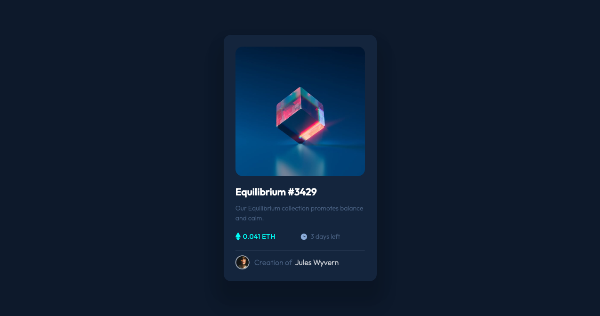

# Frontend Mentor - NFT preview card component solution

This is a solution to the [NFT preview card component challenge on Frontend Mentor](https://www.frontendmentor.io/challenges/nft-preview-card-component-SbdUL_w0U). Frontend Mentor challenges help you improve your coding skills by building realistic projects. 

## Table of contents

- [Overview](#overview)
  - [The challenge](#the-challenge)
  - [Screenshot](#screenshot)
  - [Links](#links)
- [My process](#my-process)
  - [Built with](#built-with)
  - [What I learned](#what-i-learned)
  - [Continued development](#continued-development)
  - [Useful resources](#useful-resources)
- [Author](#author)
- [Acknowledgments](#acknowledgments)

**Note: Delete this note and update the table of contents based on what sections you keep.**

## Overview

### The challenge

Users should be able to:

- View the optimal layout depending on their device's screen size
- See hover states for interactive elements

### Screenshot




### Links

- Solution URL: [Solution on Github](https://github.com/Joshua-Farr/NFT-Card-Preview)

## My process

The goal of this was to try and build the whole card using only CSS Grid as I had just completed an online tutorial. 

I broke this down my process into several different steps:
1. Create the wrapper and position it relative to the screen so that it would 
2. Align all the elements using CSS Grid to ensure compliance to the requirements
3. Style each element
4. Add active state functionality


### Built with

- Semantic HTML5 markup
- CSS custom properties
- CSS Grid
- Mobile-first workflow
- [Styled Components](https://styled-components.com/) - For styles

### What I learned


As mentioned earlier, the goal of this project was to continue practicing my HTML and CSS skills but to also build something using only CSS Grid. 

Having been accustomed to Flexbox for CSS positioning I found it initially difficult to use CSS grid, but with the help of Google and a trial-and-error methodology, I quickly became more comfortable in creating nd aligning elements with CSS Grid. 


Use this section to recap over some of your major learnings while working through this project. Writing these out and providing code samples of areas you want to highlight is a great way to reinforce your own knowledge.

To see how you can add code snippets, see below:

I'm pretty proud of this CSS code used to create the overlay. I'm still trying to get the hang of positioning but it got me what I needed. 

```css
  .overlay {
      background-color: rgba(0, 182, 158, 0.7);
      height: 100%;
      width: 100%;
      max-height: 275px;
      border-radius: 15px;
      top: 0;
      left: 0;
      position: absolute;
      z-index:99;
      opacity: 0;
  }
```

### Continued development

Movign forward I want to continue using Grid until I feel just as comfortable with it as I do with using Flexbox. 

I realize that there are optimal times to use Grid vs Flexbox but by forcing myelf into a creative corner will allow me to grow faster and more efficiently as a developer. 

Once I feel more comfortable creating more things like this from the Front-End Mentor Website I will then move on to learning the basics of JavaScript through the FreeCodeAcademy Fron-End Development Curriculum using a similar learn then build approach!


## Author

- Website - [Joshua Farr - LinkedIn](https://www.linkedin.com/in/joshuaafarr/)
- Frontend Mentor - [@Joshua-Farr](https://www.frontendmentor.io/profile/Joshua-Farr)
- Twitter - [@m152064](https://www.twitter.com/m152064)


## Acknowledgments

Huge shout out to everyone on Stack Overflow who helped respond to the many questions that helped me push through several roadblocks that I had during development. You guys are the real MVPs!
